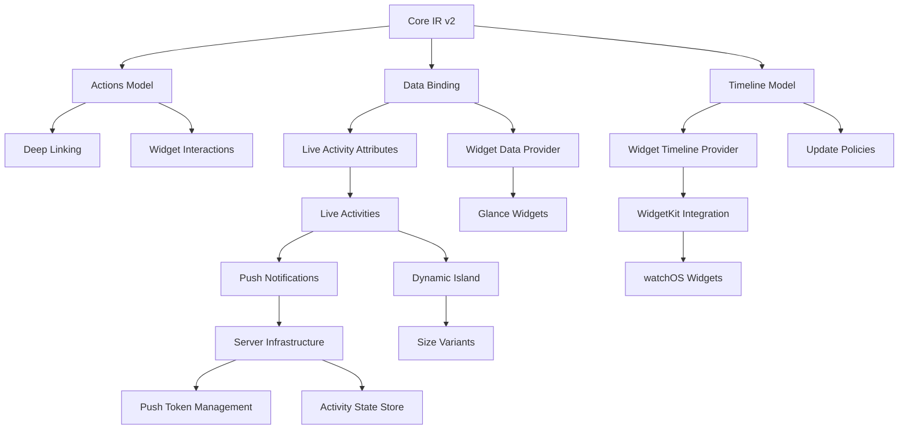

# Brik Implementation Plan - End-to-End Product Roadmap

## Executive Summary

Transform Brik from a basic widget transpiler into a comprehensive platform for React-driven native surfaces (widgets, Live Activities, Dynamic Island, watchOS) with server push capabilities.

## Current State Assessment

### ✅ What Works

- Basic JSX → IR → Native compilation pipeline
- 5 primitive components (View, Text, Button, Image, Stack)
- CLI with scan/build/doctor/clean commands
- Basic Expo plugin for Android manifest wiring
- SwiftUI and Compose generators (recently fixed)
- Hex color parsing for both platforms
- Development-time React Native preview components

### ❌ Critical Gaps

- No action/interaction model (deep links, callbacks)
- No Glance renderer for Android widgets
- No iOS WidgetKit extension automation
- No Live Activities support
- No server push infrastructure
- No watchOS support
- No Dynamic Island layouts
- Incomplete style mappings
- No data binding or timeline support
- No hot reload for widgets

## Dependency Graph



## Implementation Phases

### Phase 1: Core IR and Compiler Improvements (Week 1-2)

**Goal**: Establish robust foundation for all advanced features

#### 1.1 IR Schema v2

```typescript
// Extend schemas with:
- Action model: { type: 'deeplink' | 'openApp' | 'refresh' | 'custom', url?, params? }
- Data binding: { source: 'local' | 'remote', key: string, fallback? }
- Timeline: { entries: Entry[], policy: 'atEnd' | 'never' | 'after(minutes)' }
- Activity regions: { lockScreen?, dynamicIsland?: { compact?, expanded?, minimal? } }
- Widget metadata: { families: Size[], kind: string, configurable: boolean }
```

#### 1.2 Compiler Root Detection

- Implement `/** @brik */` pragma detection
- Add `export const BrikWidget` pattern recognition
- Create `brik.config.js` for project configuration
- Add entry point filtering to avoid scanning all JSX

#### 1.3 Style Completeness

- Map all flexbox properties to native equivalents
- Add text truncation, line limits, alignment
- Image resize modes and content scaling
- Spacing, padding, margin normalization
- Add gradient support

**Dependencies**: None
**Deliverables**: Updated @brik/schemas, @brik/compiler with v2 IR

### Phase 2: Actions and Deep Linking (Week 2-3)

**Goal**: Enable widget interactivity

#### 2.1 Action IR Implementation

```tsx
<BrikButton
  action={{
    type: 'deeplink',
    url: 'myapp://screen/detail',
    params: { id: 42 },
  }}
/>
```

#### 2.2 Platform Generators

- SwiftUI: Generate `Link`, `widgetURL`, `OpenURLAction`
- Compose/Glance: Generate `actionStartActivity`, `PendingIntent`
- Add URL scheme validation and registration helpers

#### 2.3 React Native Bridge

- Create `useBrikDeepLink` hook for handling incoming links
- Add `BrikLinkingProvider` for app-side handling
- Document URL scheme setup for both platforms

**Dependencies**: Phase 1.1 (Action model in IR)
**Deliverables**: Interactive widgets that can open app screens

### Phase 3: Native Widget Rendering (Week 3-4)

**Goal**: Generate production-ready widgets

#### 3.1 Glance Renderer for Android

- Create separate Glance generator path (`--as-widget` flag)
- Map IR to Glance components (GlanceModifier, Row, Column, Text, Image)
- Generate GlanceAppWidget class with proper content
- Add size handling and responsive layouts

#### 3.2 iOS WidgetKit Automation

- CLI command to create Widget Extension target
- Xcode project manipulation (pbxproj editing)
- Generate Info.plist and entitlements
- Map IR sizes to supportedFamilies
- Add Widget bundle and configuration

#### 3.3 Timeline Providers

- iOS: Generate TimelineProvider with entries from IR
- Android: Implement update receiver and WorkManager scheduling
- Add refresh policies and update triggers

**Dependencies**: Phase 2 (for widget interactions)
**Deliverables**: Fully functional home/lock screen widgets

### Phase 4: Live Activities Infrastructure (Week 4-6)

**Goal**: Enable Live Activities with real-time updates

#### 4.1 Activity Attributes Model

```typescript
interface ActivityAttributes {
  static: { orderId: string; merchant: string };
  dynamic: { status: string; eta: number; progress: number };
}
```

#### 4.2 iOS Implementation

- Generate ActivityAttributes struct
- Create Activity views for lock screen and Dynamic Island
- Implement size variants (compact, expanded, minimal)
- Add start/update/end APIs

#### 4.3 React Native APIs

```typescript
const activity = await Brik.startActivity('order-tracking', {
  static: { orderId: '123' },
  dynamic: { status: 'preparing' },
});

await Brik.updateActivity(activity.id, {
  dynamic: { status: 'delivering', eta: 15 },
});
```

#### 4.4 Local Update Manager

- Activity state persistence
- Update queuing and batching
- Offline support with sync

**Dependencies**: Phase 1.1 (Activity regions in IR), Phase 2 (for actions)
**Deliverables**: Live Activities with local updates

### Phase 5: Server Push Infrastructure (Week 6-8)

**Goal**: Enable server-driven updates

#### 5.1 Push Token Management

- APNs token registration (iOS)
- FCM token registration (Android)
- Token storage and lifecycle management
- Device registry service

#### 5.2 Server Components

```typescript
// Server SDK
class BrikServer {
  async updateActivity(activityId: string, payload: any) {
    // Send to APNs with activity push type
  }

  async updateWidget(userId: string, widgetData: any) {
    // Trigger widget timeline refresh
  }
}
```

#### 5.3 Infrastructure Requirements

- Message queue (Redis/RabbitMQ) for update batching
- Database for activity state (PostgreSQL/DynamoDB)
- APNs/FCM gateway service
- WebSocket server for real-time dev updates
- Rate limiting and retry logic

#### 5.4 Security

- End-to-end encryption for sensitive data
- Token refresh and rotation
- Activity ID obfuscation
- Rate limiting per device/user

**Dependencies**: Phase 4 (Live Activities must exist first)
**Deliverables**: @brik/server package, cloud infrastructure templates

### Phase 6: watchOS and Advanced Surfaces (Week 8-9)

**Goal**: Extend to all Apple surfaces

#### 6.1 watchOS Widgets

- Generate Watch App target
- Map IR subset to watchOS WidgetKit
- Handle complications and Smart Stack
- Size constraints and optimization

#### 6.2 Dynamic Island Variants

- Compact layout generator
- Expanded layout generator
- Minimal layout generator
- Animation transitions

#### 6.3 Control Center Controls (iOS 18)

- Generate Control widgets
- Map actions to control intents
- Add toggle/button controls

**Dependencies**: Phase 3 (WidgetKit foundation)
**Deliverables**: Full Apple ecosystem coverage

### Phase 7: Developer Experience (Week 9-10)

**Goal**: Production-ready DX

#### 7.1 Hot Reload

- WebSocket server for development
- File watcher with incremental compilation
- Widget preview app for both platforms
- Simulator/emulator auto-refresh

#### 7.2 Debugging Tools

- IR visualizer web UI
- Widget preview browser
- Timeline debugger
- Push notification tester

#### 7.3 CLI Enhancements

```bash
brik init --template widget
brik dev --platform ios --hot-reload
brik test --widget home-widget
brik deploy --env production
```

#### 7.4 Documentation

- Component API reference
- Platform-specific guides
- Video tutorials
- Example gallery

**Dependencies**: All previous phases
**Deliverables**: Complete developer toolkit

## Technical Architecture

### Package Structure

```
@brik/core          # IR validation, schemas v2
@brik/compiler      # JSX → IR compiler v2
@brik/react-native  # RN components + hooks
@brik/cli          # Enhanced CLI with all commands
@brik/server       # Node.js server SDK
@brik/cloud        # Infrastructure as code templates

# Targets
@brik/target-swiftui    # iOS/watchOS generator
@brik/target-glance     # Android widget generator
@brik/target-compose    # Android app UI generator

# Plugins
@brik/expo-plugin      # Full Expo integration
@brik/metro-plugin     # Hot reload support
@brik/webpack-plugin   # Web preview support
```

### Data Flow Architecture

```
1. Development Time:
   JSX → Babel → IR → File Watcher → Hot Reload → Preview

2. Build Time:
   IR → Platform Generators → Native Code → Xcode/Gradle → Widget

3. Runtime:
   Widget → Deep Link → App → React Navigation
   Server → Push → OS → Activity Update → Widget Refresh
```

## Resource Requirements

### Team Composition

- 2 Senior React Native engineers (core, compiler, RN integration)
- 1 iOS engineer (WidgetKit, Live Activities, watchOS)
- 1 Android engineer (Glance, Work Manager, widgets)
- 1 Backend engineer (push infrastructure, server SDK)
- 1 DevOps engineer (CI/CD, cloud infrastructure)
- 1 Technical writer (docs, examples)

### Infrastructure Costs

- Development: $500/month (dev servers, CI runners)
- Production: $2000-5000/month (push gateway, CDN, monitoring)
- Apple Developer: $99/year
- Google Play: $25 one-time

### Timeline

- MVP (Phases 1-3): 4 weeks
- Live Activities (Phases 4-5): 4 weeks
- Full Platform (Phases 6-7): 2 weeks
- **Total: 10 weeks for complete platform**

## Success Metrics

- Widget render performance: <50ms
- Push latency: <2s end-to-end
- Hot reload speed: <500ms
- Bundle size overhead: <100KB
- Developer adoption: 1000+ apps in 6 months
- Widget crash rate: <0.1%

## Risk Mitigation

### Technical Risks

- **iOS approval**: Pre-validate with Apple DTS
- **Android compatibility**: Test on Android 8+ devices
- **Push reliability**: Implement fallback polling
- **Performance**: Aggressive tree shaking, lazy loading

### Business Risks

- **Adoption**: Partner with popular RN libraries
- **Competition**: Focus on DX and AI-friendly APIs
- **Maintenance**: Automated testing, version matrices

## Next Immediate Steps

1. Finalize IR v2 schema with team review
2. Set up monorepo CI/CD pipeline
3. Create test suite for all platforms
4. Build example app with all features
5. Start Phase 1 implementation

## Appendix: Competition Analysis

- Widgetkit JS: iOS only, requires native code
- Flutter widgets: Requires Flutter, not RN compatible
- React Native Widgets: Abandoned, outdated
- **Brik advantage**: First complete RN solution with Live Activities

---

This plan ensures each feature has proper dependencies, infrastructure, and testing before moving to the next phase. Server push for Live Activities specifically requires Phase 5's infrastructure but builds on Phase 4's local implementation first.
