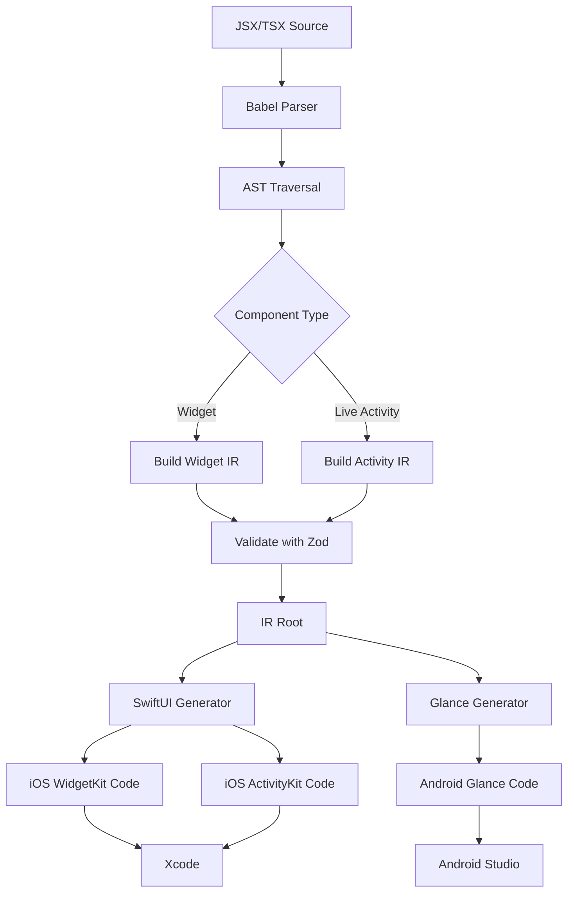

# Brik Architecture

## Overview

Brik transforms React components into native iOS and Android widgets through an intermediate representation (IR).

## Pipeline



## Core Packages

### @brik/core
- IR type definitions
- Validation with Zod schemas
- Common utilities

### @brik/schemas
- Zod schemas for IR validation
- Type exports
- Widget/Activity metadata schemas

### @brik/compiler
- Babel-based JSX/TSX parser
- AST traversal
- IR building from components
- `@brik-activity` detection
- File scanning with glob

**Key Functions:**
- `compileFiles()` - Main compilation entry point
- `buildIRNode()` - Converts JSX to IR nodes
- `hasActivityComment()` - Detects Live Activities
- `parseLiveActivityConfig()` - Extracts activity metadata

### @brik/target-swiftui
- SwiftUI code generation
- WidgetKit scaffolding
- ActivityKit code generation
- Style to SwiftUI mapping

**Generates:**
- Widget views (VStack, HStack, Text, etc.)
- Widget configurations
- TimelineProvider implementations
- ActivityAttributes structs
- Activity views (lock screen, Dynamic Island)

### @brik/target-compose
- Jetpack Compose generation
- Glance widget generation
- Style to Compose mapping

**Generates:**
- Composable functions
- Glance widget receivers
- Widget configurations

### @brik/cli
- Command-line interface
- File orchestration
- Platform-specific builds
- iOS/Android setup helpers

**Commands:**
- `scan` - Find Brik components
- `build` - Generate native code
- `doctor` - Environment check
- `clean` - Remove generated files
- `ios-setup` - iOS widget helper

### @brik/react-native
- React Native preview components
- Live Activities JavaScript API
- Native module bindings

**Components:**
- BrikView, BrikText, BrikStack, etc.
- Development-time previews

**Live Activities API:**
- `startActivity()` - Start Live Activity
- `updateActivity()` - Update activity state
- `endActivity()` - End activity
- `getActiveActivities()` - Query active activities
- `areActivitiesSupported()` - Platform check

**Native Modules:**
- `BrikLiveActivities.swift` - iOS ActivityKit bridge
- `BrikLiveActivities.m` - Objective-C bridge

### @brik/expo-plugin
- Expo config plugin
- Automatic setup for Expo projects

### @brik/babel-plugin
- Babel transform for widget development
- Development-time optimizations

### @brik/metro-plugin
- Metro bundler integration
- Module resolution

## IR Structure

### Root
```typescript
{
  version: 1,
  rootId: string,
  tree: Node,
  widget?: WidgetMetadata,
  liveActivity?: LiveActivity
}
```

### Node Types
- View - Container with children
- Text - Text display
- Button - Tappable action
- Image - Image from URL
- Stack - Horizontal/vertical layout
- Spacer - Flexible space
- ProgressBar - Progress indicator
- List - Scrollable list

### Style Structure
Styles are normalized into categories:
- **layout** - Width, height, padding, margin, flex
- **typography** - Font size, weight, color
- **colors** - Background, opacity, tint
- **borders** - Radius, width, color
- **shadows** - Color, offset, radius

### Widget Metadata
```typescript
{
  kind: string,
  displayName?: string,
  description?: string,
  families: WidgetFamily[],
  supportedPlatforms?: Platform[],
  configurable?: boolean,
  timeline?: Timeline
}
```

### Live Activity
```typescript
{
  activityType: string,
  attributes: {
    static: Record<string, any>,
    dynamic: Record<string, any>
  },
  regions: {
    lockScreen?: Node,
    dynamicIsland?: {
      compact?: Node,
      minimal?: Node,
      expanded?: Node
    }
  }
}
```

## Code Generation

### SwiftUI Generator

**Input:** IR Root
**Output:** Swift code

**Process:**
1. Traverse IR tree
2. Map IR nodes to SwiftUI views
3. Convert styles to modifiers
4. Generate view hierarchy
5. Create widget configuration
6. For activities: Generate ActivityAttributes + views

**Example Mapping:**
- `View` → `VStack` or custom view
- `Stack(horizontal)` → `HStack`
- `Stack(vertical)` → `VStack`
- `Text` → `Text().font().foregroundColor()`
- `Button` → `Button(action:)`
- `ProgressBar` → `ProgressView(value:)`

### Glance Generator

**Input:** IR Root
**Output:** Kotlin code

**Process:**
1. Traverse IR tree
2. Map IR nodes to Glance composables
3. Convert styles to GlanceModifier
4. Generate composable hierarchy
5. Create widget receiver
6. Handle click actions

**Example Mapping:**
- `View` → `Column`
- `Stack(horizontal)` → `Row`
- `Stack(vertical)` → `Column`
- `Text` → `Text(text, modifier, style)`
- `Button` → `Button(text, onClick)`
- `ProgressBar` → `LinearProgressIndicator`

## Data Flow

### Widget Build Flow
```
1. User writes JSX component
2. Compiler scans files with glob
3. Babel parses JSX to AST
4. Traverse AST, find Brik components
5. Build IR from JSX structure
6. Validate IR with Zod
7. Generate platform code (SwiftUI/Glance)
8. Write to ios/ or android/ directories
9. Developer adds to Xcode/Android Studio
10. Native code compiles to app
```

### Live Activity Flow
```
1. User writes @brik-activity function
2. Compiler detects JSDoc comment
3. Parse activity configuration object
4. Extract static/dynamic attributes
5. Build IR for each region
6. Generate ActivityAttributes struct
7. Generate activity views
8. Write Swift files to ios/BrikActivities/
9. User calls Brik.startActivity() from JS
10. Native module starts ActivityKit activity
11. Lock screen + Dynamic Island show UI
12. User calls updateActivity() to update
13. Native module updates ContentState
14. UI refreshes in real-time
```

## Platform Integration

### iOS (WidgetKit)
- Widget Extension target in Xcode
- Info.plist configuration
- TimelineProvider for updates
- DeepLink handling via URL schemes

### iOS (ActivityKit)
- Activity extension or main app
- Info.plist NSSupportsLiveActivities
- Push notifications for remote updates
- ActivityAttributes + ContentState

### Android (Glance)
- Widget receiver in AndroidManifest.xml
- Widget info XML resource
- RemoteViews for widget UI
- PendingIntent for actions

## Performance

### Compilation
- Fast AST traversal with Babel
- Incremental builds (planned)
- Cached IR (planned)

### Runtime
- No JavaScript runtime on device
- Pure native widgets
- Native rendering performance
- Minimal battery impact

## Security

- No code execution in widgets
- Sandboxed native code
- URL validation for deep links
- No arbitrary code in activities

## Extensibility

### Adding New Components
1. Add IR node type to schemas
2. Add React component to @brik/react-native
3. Add SwiftUI mapping in target-swiftui
4. Add Glance mapping in target-compose
5. Update compiler if needed

### Adding New Platforms
1. Create new @brik/target-{platform} package
2. Implement IR → platform code generator
3. Integrate with CLI
4. Add platform-specific setup

## Testing Strategy

- Unit tests for compiler
- Unit tests for code generators
- IR validation tests
- Integration tests (planned)
- Device testing (manual)


